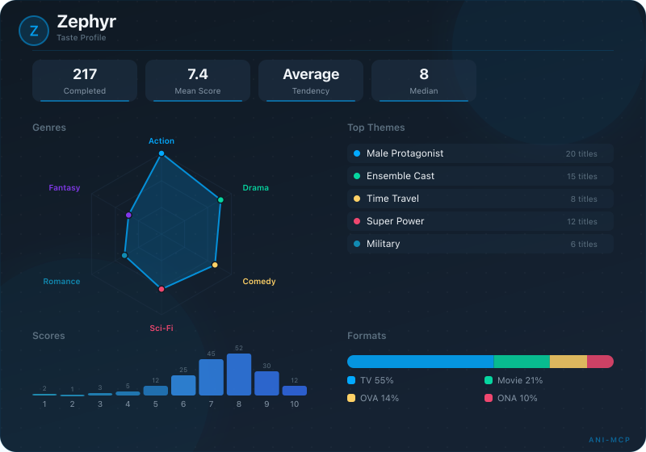
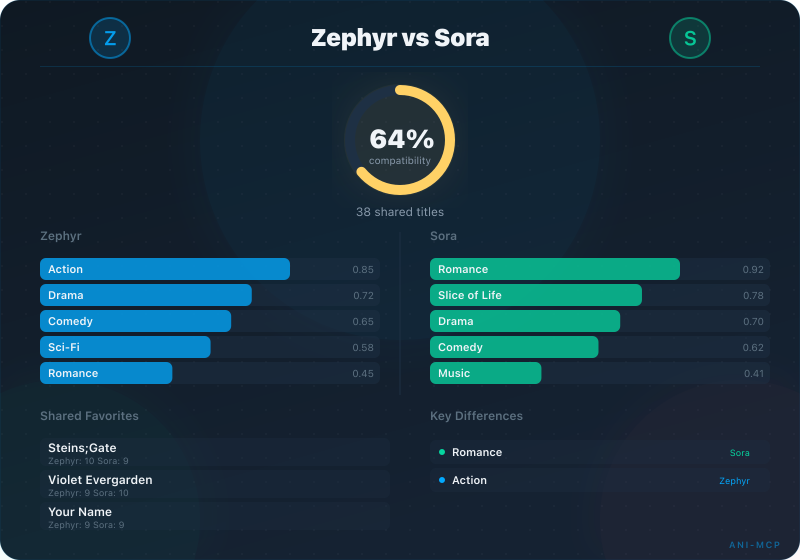

<p align="center">
  
</p>

# ani-mcp

[](https://www.npmjs.com/package/ani-mcp)
[](https://www.npmjs.com/package/ani-mcp)
[](https://github.com/gavxm/ani-mcp/actions/workflows/ci.yml)
[](https://opensource.org/licenses/MIT)
[](https://github.com/gavxm/ani-mcp/releases/latest)

A smart [MCP](https://modelcontextprotocol.io) server for [AniList](https://anilist.co) that understands your anime and manga taste - not just raw API calls.

## What makes this different

Most AniList integrations mirror the API 1:1. ani-mcp adds an intelligence layer on top:

- **Taste profiling** - builds a model of your preferences from your completed list
- **Personalized picks** - "what should I watch next?" based on your taste, mood, and seasonal lineup
- **Compatibility** - compare taste between two users
- **Sequel alerts** - find sequels airing this season for shows you've finished
- **Watch order** - franchise chain traversal for long-running series
- **Session planning** - "I have 90 minutes, what should I watch?" from your current list
- **Year in review** - your watching/reading stats wrapped up

Plus the essentials: search, details, trending, seasonal browsing, list management, social features, and community recommendations. All search and browse tools support pagination for browsing beyond the first page of results.

## Try it in 30 seconds

No account needed. Works with any MCP-compatible client.

### Claude Desktop

Add to your config file (`Settings > Developer > Edit Config` or `~/Library/Application Support/Claude/claude_desktop_config.json` on macOS):

```json
{
  "mcpServers": {
    "anilist": {
      "command": "npx",
      "args": ["-y", "ani-mcp"]
    }
  }
}
```

Restart Claude Desktop after saving.

Alternatively, download `ani-mcp.mcpb` from the [latest release](https://github.com/gavxm/ani-mcp/releases/latest) and install via `Settings > Extensions`.

### Claude Code

```sh
claude mcp add ani-mcp -- npx -y ani-mcp
```

### Personalized features

Add your username for recommendations, taste profiling, and list management:

```json
{
  "mcpServers": {
    "anilist": {
      "command": "npx",
      "args": ["-y", "ani-mcp"],
      "env": {
        "ANILIST_USERNAME": "your_username"
      }
    }
  }
}
```

For write operations (updating progress, scoring, list edits), also add `ANILIST_TOKEN`. See [Environment Variables](#environment-variables) for details.

## Environment Variables

| Variable | Required | Description |
| --- | --- | --- |
| `ANILIST_USERNAME` | No | Default username for list and stats tools. Can also pass per-call. |
| `ANILIST_TOKEN` | No | AniList OAuth token. Required for write operations and private lists. |
| `ANILIST_TITLE_LANGUAGE` | No | Title preference: `english` (default), `romaji`, or `native`. |
| `ANILIST_SCORE_FORMAT` | No | Override score display: `POINT_100`, `POINT_10_DECIMAL`, `POINT_10`, `POINT_5`, `POINT_3`. |
| `ANILIST_NSFW` | No | Set to `true` to include adult content in results. Default: `false`. |
| `ANILIST_MOOD_CONFIG` | No | JSON object to add or override mood keywords. See [Mood config](#mood-config). |
| `DEBUG` | No | Set to `true` for debug logging to stderr. |
| `MCP_TRANSPORT` | No | Set to `http` for HTTP Stream transport. Default: stdio. |
| `MCP_PORT` | No | Port for HTTP transport. Default: `3000`. |
| `MCP_HOST` | No | Host for HTTP transport. Default: `localhost`. |

## Tools

### Search & Discovery

| Tool | Description |
| --- | --- |
| `anilist_search` | Search anime/manga by title with genre, year, and format filters |
| `anilist_details` | Full details, relations, and recommendations for a title |
| `anilist_seasonal` | Browse a season's anime lineup |
| `anilist_trending` | What's trending on AniList right now |
| `anilist_genres` | Browse top titles in a genre with optional filters |
| `anilist_genre_list` | List all valid genres and content tags |
| `anilist_recommendations` | Community recommendations for a specific title |

### Lists & Stats

| Tool | Description |
| --- | --- |
| `anilist_list` | A user's anime/manga list, filtered by status |
| `anilist_lookup` | Check if a specific title is on a user's list |
| `anilist_stats` | Watching/reading statistics, top genres, score distribution |

### Intelligence

| Tool | Description |
| --- | --- |
| `anilist_taste` | Generate a taste profile from your completed list |
| `anilist_pick` | Personalized "what to watch next" from your backlog, seasonal lineup, or discovery pool |
| `anilist_compare` | Compare taste compatibility between two users |
| `anilist_wrapped` | Year-in-review summary |
| `anilist_explain` | "Why would I like this?" - score a title against your taste profile |
| `anilist_similar` | Find titles similar to a given anime or manga |
| `anilist_sequels` | Sequels airing this season for titles you've completed |
| `anilist_watch_order` | Viewing order for a franchise |
| `anilist_session` | Plan a viewing session within a time budget |
| `anilist_mal_import` | Import a MyAnimeList user's list and generate recommendations |
| `anilist_kitsu_import` | Import a Kitsu user's list and generate recommendations |

### Cards

| Tool | Description |
| --- | --- |
| `anilist_taste_card` | Generate a shareable taste profile card as a PNG image |
| `anilist_compat_card` | Generate a compatibility card comparing two users as a PNG image |

<p align="center">
  
  
</p>

### Info

| Tool | Description |
| --- | --- |
| `anilist_staff` | Staff credits and voice actors for a title |
| `anilist_staff_search` | Search for a person by name and see all their works |
| `anilist_studio_search` | Search for a studio and see their productions |
| `anilist_schedule` | Airing schedule and next episode countdown |
| `anilist_airing` | Upcoming episodes for titles you're currently watching |
| `anilist_characters` | Search characters by name with appearances and VAs |
| `anilist_whoami` | Check authentication status and score format |

### Social

| Tool | Description |
| --- | --- |
| `anilist_profile` | View a user's profile, bio, favourites, and stats |
| `anilist_feed` | Recent activity from a user's feed |
| `anilist_reviews` | Community reviews for a title |
| `anilist_favourite` | Toggle favourite on anime, manga, character, staff, or studio |
| `anilist_activity` | Post a text activity to your feed |
| `anilist_group_pick` | Find anime/manga for a group to watch together |
| `anilist_shared_planning` | Find overlap between two users' planning lists |
| `anilist_follow_suggestions` | Rank followed users by taste compatibility |
| `anilist_react` | Like or reply to an activity |

### Analytics

| Tool | Description |
| --- | --- |
| `anilist_calibration` | Per-genre scoring bias vs community consensus |
| `anilist_drops` | Drop pattern analysis - genre/tag clusters and median drop point |
| `anilist_evolution` | How your taste shifted across 2-year time windows |
| `anilist_completionist` | Franchise completion tracking via relation graph |
| `anilist_seasonal_stats` | Per-season pick/finish/drop rates |
| `anilist_pace` | Estimated completion date for currently watching titles |

### Write (requires `ANILIST_TOKEN`)

| Tool | Description |
| --- | --- |
| `anilist_update_progress` | Update episode or chapter progress |
| `anilist_add_to_list` | Add a title to your list with a status |
| `anilist_rate` | Score a title (0-10) |
| `anilist_delete_from_list` | Remove an entry from your list |
| `anilist_undo` | Undo the last write operation |
| `anilist_unscored` | List completed but unscored titles for batch scoring |
| `anilist_batch_update` | Bulk filter + action on list entries (dry-run default) |

## Resources

MCP resources provide context to your AI assistant without needing a tool call. Clients that support resources can automatically include this information in conversations.

| Resource | Description |
| --- | --- |
| `anilist://profile` | Your AniList profile with bio, stats, and favourites |
| `anilist://taste/{type}` | Taste profile (genre weights, themes, scoring patterns) for ANIME or MANGA |
| `anilist://list/{type}` | Currently watching/reading entries with progress and scores |

## Prompts

Pre-built conversation starters that clients can offer as quick actions.

| Prompt | Description |
| --- | --- |
| `setup` | Walk through connecting your AniList account step by step |
| `seasonal_review` | Review this season's anime against your taste profile |
| `what_to_watch` | Plan what to watch now with optional mood and time budget |
| `roast_my_taste` | Get a humorous roast of your anime taste |
| `compare_us` | Compare your taste with another user |
| `year_in_review` | Your anime/manga year in review |
| `explain_title` | Why would you like (or dislike) a specific title? |
| `find_similar` | Find titles similar to one you enjoyed |

## Examples

Here are some things you can ask your AI assistant once ani-mcp is connected:

**"What should I watch next?"**
Uses `anilist_pick` to analyze your completed list, build a taste profile, and recommend titles from your Planning list ranked by how well they match your preferences.

**"I want something dark and psychological"**
Uses `anilist_pick` with mood filtering to boost titles matching that vibe and penalize mismatches.

**"What's good this season?"**
Uses `anilist_pick` with `source: SEASONAL` to rank currently airing anime against your taste profile.

**"I have 90 minutes, what should I watch tonight?"**
Uses `anilist_session` to pick from your currently watching list and fill a time budget with the best-matching episodes.

**"Any sequels airing for stuff I've finished?"**
Uses `anilist_sequels` to cross-reference your completed list with this season's lineup.

**"What order do I watch Fate in?"**
Uses `anilist_watch_order` to traverse the franchise relation graph and produce a numbered viewing order.

**"Compare my taste with username123"**
Uses `anilist_compare` to find shared titles, compute a compatibility score, and highlight biggest disagreements.

**"Why would I like Vinland Saga?"**
Uses `anilist_explain` to score a title against your taste profile, breaking down genre affinity and theme alignment.

**"Show me my anime year in review"**
Uses `anilist_wrapped` to summarize everything you watched in a given year.

## Mood config

`anilist_pick` and `anilist_session` accept a freeform `mood` string. Built-in keywords include: dark, chill, hype, action, romantic, funny, brainy, sad, scary, epic, wholesome, intense, mystery, fantasy, scifi, trippy, nostalgic, artistic, competitive, cozy.

To add or override keywords, set `ANILIST_MOOD_CONFIG` as a JSON object:

```json
{
  "ANILIST_MOOD_CONFIG": "{\"cozy\":{\"boost\":[\"Slice of Life\",\"Iyashikei\"],\"penalize\":[\"Horror\"]},\"mykeyword\":{\"boost\":[\"Romance\"],\"penalize\":[]}}"
}
```

Each key is a mood keyword mapping to `{ boost: string[], penalize: string[] }` arrays of AniList genres and tags.

## Privacy

See [PRIVACY.md](PRIVACY.md) for details. In short: ani-mcp runs locally, sends requests only to the AniList API, stores nothing, and collects no analytics.

## Docker

```sh
docker build -t ani-mcp .
docker run -e ANILIST_USERNAME=your_username ani-mcp
```

Runs on port 3000 with HTTP Stream transport by default.

## Build from Source

```sh
git clone https://github.com/gavxm/ani-mcp.git
cd ani-mcp
npm install
npm run build
npm test
```

## Support

Bug reports and feature requests: [GitHub Issues](https://github.com/gavxm/ani-mcp/issues)

## License

[MIT](LICENSE)
